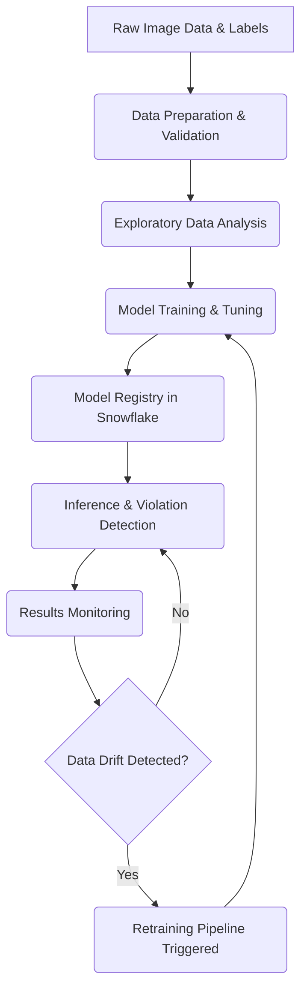

# Helmet Violation Detection System: Project Details & Workflow

## Overview
This project is an advanced, production-grade deep learning framework built to automate the detection of helmet violations using computer vision. It utilizes a custom-trained **YOLOv8** model for robust object detection and integrates deeply with **Snowflake** for data warehousing, model registry, and performance monitoring. A complete, interactive web application is provided via **Streamlit** to handle everything from Exploratory Data Analysis (EDA) and Training visualization to live inference.

## Technical Architecture
The core components of the system revolve around a seamless flow from raw data ingestion to production inference.

### 1. Technology Stack
*   **Computer Vision Engine:** YOLOv8 (specifically `yolov8m.pt`)
*   **Data Warehouse / Backend:** Snowflake (handling metadata, training logs, inference results, and model registries)
*   **Frontend Interface:** Streamlit (interactive dashboards)
*   **Hyperparameter Tuning:** Optuna (integrated with the YOLOv8 training pipeline)
*   **Language:** Python 3.x

### 2. Detection Classes & Logic
The YOLOv8 model is trained to recognize 4 specific classes:
1.  **Helmet (0)**: Rider is wearing a helmet.
2.  **Motorbike (1)**: The vehicle itself.
3.  **NoHelmet (2)**: Rider is explicitly lacking a helmet.
4.  **PNumber (3)**: The vehicle's number plate.

**Violation Logic**: A violation is strictly defined as detecting a "NoHelmet" class. The inference engine uses distance calculation heuristics (pixel proximity) to map a detected "NoHelmet" bounding box to a corresponding "Motorbike" bounding box, enabling the system to attribute the violation to a specific vehicle.

### 3. Snowflake Data Schema
Snowflake acts as the central state store. The project auto-provisions the `HELMET_DETECTION_DB` database containing 4 distinct schemas:
*   `RAW_DATA`: Contains dataset metadata and configuration schemas (`DATASET_METADATA` table and `RAW_IMAGES_STAGE`).
*   `PROCESSED`: Holds Exploratory Data Analysis statistics (`EDA_STATISTICS` table).
*   `MODELS`: Acts as the MLFlow equivalent, storing metadata for training runs, epoch-level metrics, and the model registry itself (`TRAINING_RUNS`, `TRAINING_METRICS`, `MODEL_REGISTRY` tables).
*   `RESULTS`: Logs individual inference sessions, explicit detection records, and a retraining queue (`INFERENCE_LOGS`, `DETECTION_RESULTS`, `RETRAINING_QUEUE`).

---

## End-to-End Workflow

The pipeline is modeled as a cyclic ML workflow, moving continuously from preparation to monitoring and retraining.

### Phase 1: Data Preparation & Upload
*   The raw dataset (YOLO format) is validated for structural integrity.
*   Dataset metadata (image dimensions, split allocations, class distributions) is parsed and uploaded to the `RAW_DATA.DATASET_METADATA` table in Snowflake.

### Phase 2: Exploratory Data Analysis (EDA)
*   Before training, statistical tests and visualizations are generated.
*   Scripts analyze class imbalances, bounding box sizes, aspect ratios, and general image quality (brightness, contrast).
*   These computed metrics are permanently logged into the `PROCESSED.EDA_STATISTICS` table.

### Phase 3: Training & Hyperparameter Tuning
*   The system uses YOLOv8m as the base architecture.
*   The training pipeline hooks directly into Snowflake. For every epoch run, precision, recall, and mAP metrics are pushed to the `MODELS.TRAINING_METRICS` table.
*   *Optuna* can be utilized for hyperparameter tuning to find optimal learning rates, momentum, and augmentation strategies.
*   Once training finishes, the "best" model weights are promoted.

### Phase 4: Model Registry
*   The highest-performing model weights (`best.pt`) are uploaded to a secure Snowflake internal stage (`MODEL_WEIGHTS_STAGE`).
*   Metadata such as accuracy (e.g., mAP50=96.3%) and deployment status are tracked in the `MODELS.MODEL_REGISTRY` table.

### Phase 5: Inference Pipeline
*   Images or Videos are passed through the registered model.
*   The inference engine auto-resizes inputs to `960x960` pixels to match the training distributions.
*   Bounding boxes are drawn dynamically (using a defined BGR/RGB color map).
*   Violation logic analyzes bounding boxes. If a violation is found, the system crops the relevant sections (e.g., the rider and the number plate).
*   Every detection and violation is pushed to `RESULTS.DETECTION_RESULTS`.

### Phase 6: Monitoring & Retraining
*   The system monitors the incoming inference data for "data drift" (e.g., new environments, changing weather conditions, or new camera angles).
*   If enough "novel" data is queued in `RESULTS.RETRAINING_QUEUE` (default minimum 50 images), the retraining pipeline is triggered.
*   The pipeline combines old data with new data, retrains the model, compares performance against the currently registered model, and conditionally updates the production weights.
